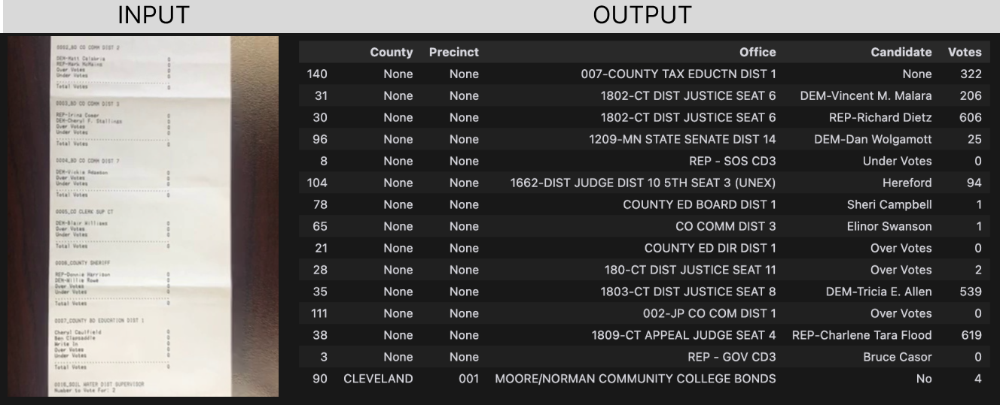

# POLL TAPE COUNTER WITH GPT-4V

This project uses GPT-4V to count votes from poll tapes. Poll tapes are the printed results from voting machines, and this code processes images of these tapes to extract and tally the vote data.

The accuracy of the program depends on the quality of the input data and has not been evaulated at all — this is an experimental technology, use at your own risk!

It currently generates errors ~30% of the time, but those seem mostly to be when the image is too blurry to process. I expect you could update the schema to handle those cases.

All usages expect jpg images in the data directory. subdirectories within at least one level have been tested and work too.

Built on python 3.10.10.

Start by cloning this project.

## Instructions for Command Line Usage:
1. Navigate to the project directory in your terminal.
2. Set the environment variable "OPENAI_API_KEY" with `export OPENAI_API_KEY=your_api_key_here`
3. Run the script with the directory and number of images to process as arguments. For example: `python src/read_poll_tape.py ../data 10` processes ten images.
4. The csv will be saved to your working directory

## Instructions for using Python Notebook:
I recommend using the VS Code Jupyter extension.

1. set up virtualenv: `python -m venv libs`
2. `source libs/bin/activate`
3. Install req's: `pip install requirements.txt`
4. (If NOT using VS Code) run `jupyter lab` to start server
5. open `src/read_poll_tape.ipynb`
6. Run the cell containing `image_uris = load_image_uris()` to load all image URIs
7. Input your own OpenAI API key in the `get_transcription` cell
8. Run the cell containing `df, non_compliant_schemas = process_images()` to process all images, one at a time to reduce memory storage. [TODO: add multiple per call or go multi-threaded]
9. The processed data is saved in `df` and non-compliant schemas are saved in `non_compliant_schemas` (again, mostly blurry images but please review)
10. To save the processed data to a CSV file, run the cell containing `df.to_csv('processed_images.csv', index=False)` [TODO: de-dupe results somehow] [TODO: retry or recovery logic for non-compliant schemas or other errors].

## License

MIT License

Copyright (c) [2023] [Max Caldwell]

Permission is hereby granted, free of charge, to any person obtaining a copy
of this software and associated documentation files (the "Software"), to deal
in the Software without restriction, including without limitation the rights
to use, copy, modify, merge, publish, distribute, sublicense, and/or sell
copies of the Software, and to permit persons to whom the Software is
furnished to do so, subject to the following conditions:

The above copyright notice and this permission notice shall be included in all
copies or substantial portions of the Software.

THE SOFTWARE IS PROVIDED "AS IS", WITHOUT WARRANTY OF ANY KIND, EXPRESS OR
IMPLIED, INCLUDING BUT NOT LIMITED TO THE WARRANTIES OF MERCHANTABILITY,
FITNESS FOR A PARTICULAR PURPOSE AND NONINFRINGEMENT. IN NO EVENT SHALL THE
AUTHORS OR COPYRIGHT HOLDERS BE LIABLE FOR ANY CLAIM, DAMAGES OR OTHER
LIABILITY, WHETHER IN AN ACTION OF CONTRACT, TORT OR OTHERWISE, ARISING FROM,
OUT OF OR IN CONNECTION WITH THE SOFTWARE OR THE USE OR OTHER DEALINGS IN THE
SOFTWARE.